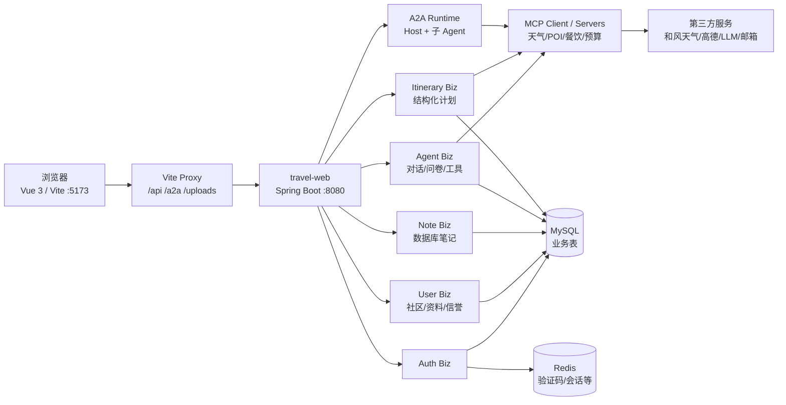

# Roamly 当前架构说明

> 版本：2026-08-31  
> 以根 `pom.xml`、`travel-web` 启动模块和前端 Vite 配置为准。旧的 PR 设计稿仍保留在 `doc/ARCHITECTURE.md`，但不作为当前端口和模块关系的依据。

## 1. 系统边界

Roamly 由两个同级工程组成：

- `travel-agent-front`：Vue 3 + Vite 的用户界面，负责路由、编辑器、卡片展示、SSE 消费和本地源文件快照。
- `travel-agent-back`：Java 17 + Spring Boot 3.2.4 的模块化服务，负责认证、用户资料、社区、笔记、旅行规划、Agent 编排、MCP 工具和持久化。



`travel-web` 是当前浏览器面向的聚合入口。A2A 和 MCP 子模块同时保留独立服务配置，便于后续拆分部署；拆分后只需要调整环境变量/客户端 URL，不应改变前端业务协议。

## 2. Maven 模块与职责

| 模块 | 责任 | 关键入口 |
|---|---|---|
| `travel-common` | 统一响应、异常、限流、工具和公共模型 | `ApiResult`、`GlobalExceptionHandler` |
| `travel-module-auth-biz` | 用户名/邮箱登录、Token、验证码 | `AuthController`、`AuthApplicationService` |
| `travel-module-user-biz` | 用户资料、偏好、灵感、旅程、社区互动、版权治理 | `UserApi`、`UserBizService` |
| `travel-module-note-biz` | 数据库笔记 CRUD、内容块、图片存储 | `NoteController`、`NoteApplicationService` |
| `travel-module-agent-biz` | 旧版文本规划、对话会话、问卷 Agent、地点图片 | `TravelAgentController`、`AgentApi`、`AgentQuestionnaireController` |
| `travel-module-itinerary-biz` | 固定格式旅行计划 DTO、每日计划和数据告警 | `TravelPlanningApi` |
| `travel-a2a-runtime` | Host Agent、子 Agent、并行工具调用、SSE 事件 | `A2aTaskController`、`HostAgentService` |
| `travel-module-mcp-biz` | MCP 协议、客户端和天气/POI/餐饮/预算/行程服务 | `*McpController` |
| `travel-web` | Spring Boot 聚合启动、组件扫描、MyBatis 扫描 | `TravelWebApplication` |

模块内部按“接口 → 应用服务 → 领域/编排 → 基础设施”组织。Controller 不直接拼复杂 SQL；现有用户社区的部分兼容逻辑仍集中在 `UserBizService`，后续可以拆成 `SocialModerationService`、`ReputationService` 和 `SocialNoteService`，但先保持 API 不变。

## 3. 持久化边界

### 3.1 数据库内容

| 数据域 | 表 | 说明 |
|---|---|---|
| 身份 | `auth_account`、`auth_session` | 登录身份、Token 会话、邮箱验证码相关状态 |
| 用户 | `user_profile`、`user_travel_preference`、`user_destination_preference` | 昵称、头像、手机号、旅行偏好和目的地偏好 |
| 个人笔记 | `note_document`、`note_block` | 可编辑、可分享的数据库笔记；`content` 保存 Markdown/HTML 内容 |
| 旅行内容 | `travel_note`、`journey`、`journey_point`、`journey_image`、`inspiration` | 旅行计划、历史旅程和灵感目的地 |
| Agent | `chat_session`、`chat_message`、`agent_questionnaire` | 对话会话、消息和五步问卷状态 |
| 社区 | `social_note`、`social_comment`、`social_reaction`、`social_friend_request` | 公开帖子和互动 |
| 版权治理 | `social_note_revision`、`social_note_report`、`social_note_moderation`、`social_platform_review` | 复制/协作版本、举报、Agent 识别流水和平台审核队列 |
| 信誉 | `social_user_reputation`、`social_reputation_event` | 当前分值和每次扣分/恢复流水 |

### 3.2 复制与本地编辑的边界

社区复制链：

```text
social_note.id
    └── note_document.source_social_note_id
            └── social_note_revision.private_note_id
                    └── 发布成功后 social_note_revision.published_note_id
```

这个链路只认帖子 ID，不认聊天 session。`state_code`/`revision_code` 是版本状态码，不是会话标识。

本地编辑工作区不进入数据库：

```text
文件路径标签 + 文件句柄 -> IndexedDB
编辑内容快照 + 工作区索引 -> localStorage
```

这样“打开文件”可以写回原文件，“导入文件/新建笔记”才进入 `note_document`，两种行为不会互相覆盖。

## 4. 前端布局与状态边界

```text
App.vue
├── AppHeader              顶部搜索、内容 Tab、全局操作
├── AppSidebar              主导航、登录用户入口
├── router-view             当前主工作区
├── GlobalRightPanel        发现灵感、Agent、网页/辅助面板
└── CommandPalette          快速导航和命令
```

主要页面路由：

| 路由 | 页面 | 主要职责 |
|---|---|---|
| `/explore` | 发现页 | 社区帖子、作者入口、规划 CTA |
| `/chat` | `PlannerHub` | 固定表单和交互式 Agent 两个 Tab |
| `/users/search`、`/users/:id` | 用户搜索/主页 | 昵称头像、公开帖子和好友申请 |
| `/notes` | 编辑器 | 数据库笔记、本地工作区、Markdown 排版/源码/协同 |
| `/profile` | 个人主页 | 资料编辑、公开帖子、滚动区域 |
| `/inspirations` | 灵感目的地 | 目的地卡片和收藏 |
| `/journeys` | 我的旅程 | 旅行记录和地图入口 |

视觉主题使用 `App.vue` 的动态 CSS 变量：`--paper`、`--forest`、`--roam`、`--sunset`、`--line`、`--card`。共享壳层只增加层次、阴影和背景纹理，不覆盖用户在笔记主题面板保存的颜色。

## 5. 可靠性与安全边界

1. **外部数据不静默伪造**：结构化计划通过 `dataWarnings` 告诉 UI 哪个供应商不可用；A2A 规划在 LLM 输出质量不足时使用确定性每日计划兜底。
2. **流式响应可取消**：前端 SSE 使用 `AbortController`，服务端在 `onTimeout/onCompletion/onError` 中释放 emitter。
3. **上传路径与数据库分离**：数据库只保存访问路径；上传文件由后端存储服务管理，生产环境应把目录迁移到对象存储或持久卷。
4. **身份参数仍需收口**：当前社区、偏好等接口的一部分可通过 query/body 指定 `userId`，这是已知风险；生产上线前应统一改为 Token 用户，并保留管理员审核角色。
5. **编辑权限必须在后端复核**：前端按钮隐藏不是权限控制。原作者审核 PR、贡献者提交版本、平台处理审核队列都必须由服务层校验身份和状态。

## 6. 启动与验证

后端：

```bash
./mvnw spring-boot:run -pl travel-web -am
```

前端：

```bash
npm install
npm run dev -- --host 127.0.0.1
```

启动前准备：

1. 创建 MySQL `travel_agent` 数据库。
2. 按顺序检查 `data/schema_clean.sql` 和各业务 migration；已有库只执行对应 migration，不要重复执行会 `DROP TABLE` 的纯净 schema。
3. 配置 `TRAVEL_DB_*`、Redis、邮箱、天气、高德和 LLM 环境变量。
4. 登录后再回归 `/explore`、`/chat`、`/notes`、`/profile` 和 `/users/search`；未登录时前端会重定向 `/auth`。

API、请求链路和数据库变更的详细说明分别见 [`API-CURRENT.md`](API-CURRENT.md)、[`REQUEST-FLOWS.md`](REQUEST-FLOWS.md) 和 [`data/`](../data/)。
