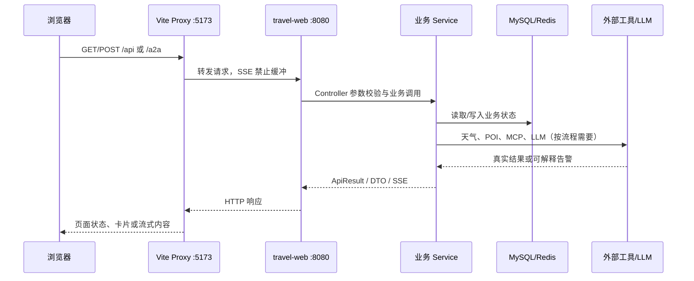
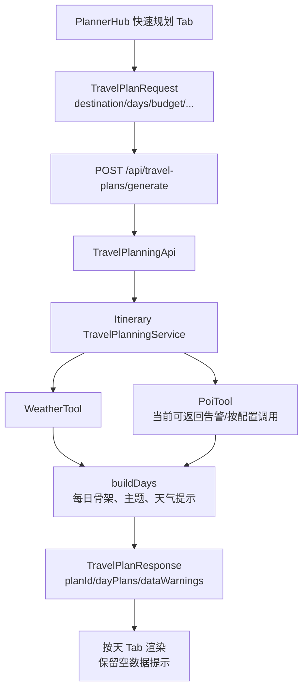
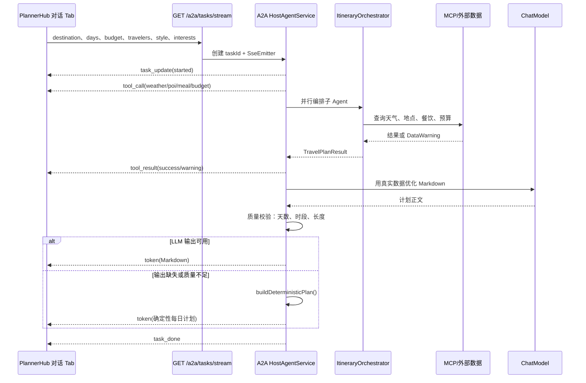
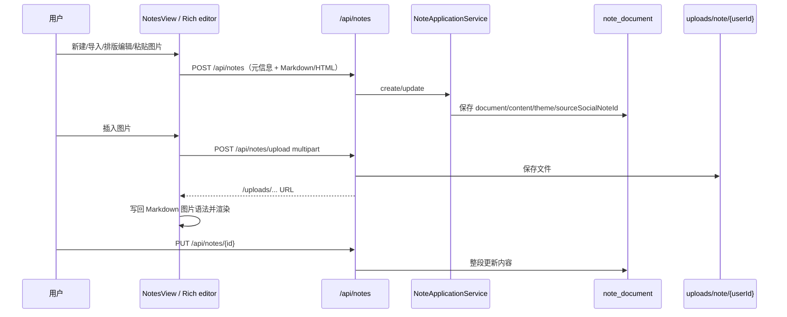
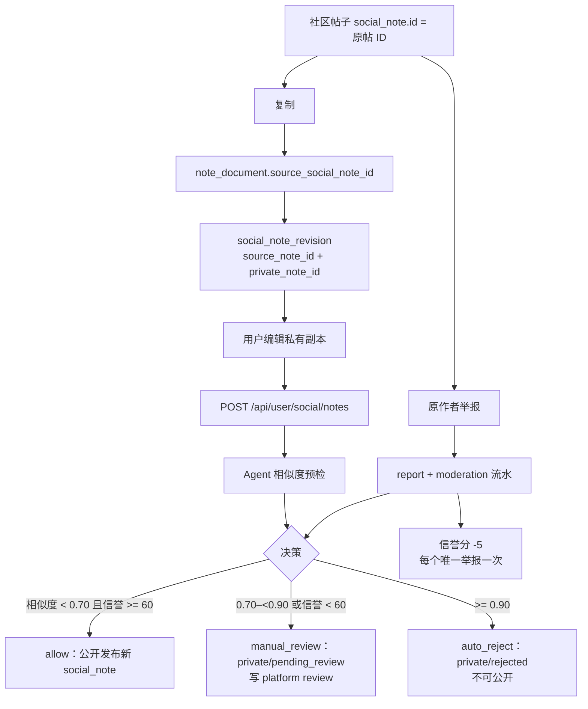

# Roamly 核心请求链路

> 这份文档解释“用户动作如何经过前端、Controller、Service、外部工具和数据库”。路径和事件名称以 2026-08-31 当前实现为准。

## 1. 页面请求总链路



Axios 请求从 `src/api/index.ts` 统一注入 Token；SSE 因为需要 `ReadableStream`，由 `src/api/agent.ts` 使用 `fetch` 单独消费。

## 2. 固定表单规划链路



稳定性约束：

- 目的地、天数、预算先在 DTO 层校验，避免服务层收到非法值。
- 每一天都由 `buildDays` 创建，即使天气或 POI 不可用，也返回日期/主题/预算/提示骨架。
- 供应商不可用写入 `dataWarnings`；不把“没有真实数据”伪装成真实景点、餐厅或价格。
- `estimatedCost` 在缺少可靠价格时返回 0，并通过提示说明原因；UI 应展示“待确认”，而不是把 0 当成免费。

## 3. 交互式 Agent / A2A SSE 链路



前端不要只等待 `task_done` 才渲染正文：`token` 到达就增量显示；收到 `error` 要保留已经显示的内容并给出重试入口。`task_done` 用于结束 loading、记录 `planId` 和刷新右侧预览。

## 4. 五步问卷 Agent 链路

```text
POST /api/agent/questionnaire/start
  -> agent_questionnaire 插入 active 记录
  -> 返回 sessionId、stepIndex=0 和首问题

POST /api/agent/questionnaire/{sessionId}/answer?step=N&answer=...
  -> 查询会话
  -> normalizeStep（LLM 或确定性解析）
  -> 更新 answers/current_step
  -> 必要时触发天气或 search_pois
  -> 未完成：SSE next_question
  -> 完成：ReAct 循环 -> SSE plan -> status=completed
```

这里的 `sessionId` 只属于问卷会话状态。它不参与社区复制、版权举报、版本合并或帖子发布判定。

## 5. 数据库笔记编辑链路

### 5.1 数据库笔记



### 5.2 本地源文件

```text
打开文件
  -> File System Access API 读取文件
  -> 保存句柄到 IndexedDB
  -> 保存路径标签、大小、时间、文本快照到 localStorage
  -> 编辑区默认排版 Markdown；源码/协同只是视图切换
  -> Ctrl/Cmd + S 写回原文件，同时更新快照
```

本地工作区没有服务器文件内容的所有权。即使 localStorage 清空，原文件仍在用户文件系统；如果路径或句柄失效，应用只提示重新选择文件，不把快照冒充成数据库文档。

## 6. 社区复制、发布和版权治理链路



关键不变量：

1. 原帖的公开内容在协作 PR 合并前不改变。
2. `social_note_revision.revision_code` 是版本编号；每次提交/合并的公开状态切换都可追踪。
3. 复制存档 `archived` 不对外展示；只有经过版权预检并符合信誉规则的发布才创建公开帖子。
4. 举报人/帖子/类型唯一约束避免重复举报重复扣分。
5. Agent 只负责相似度预筛和分流；人工审核决定最终处置，不把模型判断伪装成司法结论。

## 7. 个人主页与社区点击链路

```text
社区卡片/评论作者头像
  -> 读取 public_id / userId
  -> GET /api/user/users/{userId}/profile
  -> GET /api/user/social/notes?ownerId={userId}
  -> /users/{userId} 公开主页
```

评论显示昵称和头像依赖服务端查询 `user_profile`/偏好表的 COALESCE 结果。前端不应直接把 ID 当作展示名称；查不到昵称时才使用“旅行者”或 ID 作为降级。

## 8. 新功能接入检查表

- 是否明确数据最终落在 MySQL、Redis、IndexedDB 还是 localStorage？
- 是否有可追踪的业务 ID，而不是把 UI 状态或 session 当作资源 ID？
- 是否为加载中、空数据、外部服务失败、权限拒绝和重试提供稳定 UI 状态？
- JSON 接口是否更新 `src/api` 类型和 [`API-CURRENT.md`](API-CURRENT.md)？
- SSE 是否声明事件名、关闭 emitter、可取消，并在代理层禁止缓冲？
- 是否在 Service 层再次校验用户和资源的归属？
